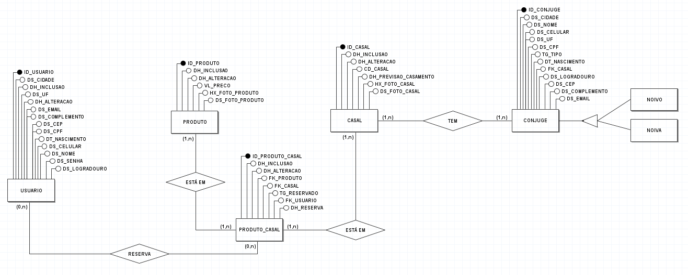
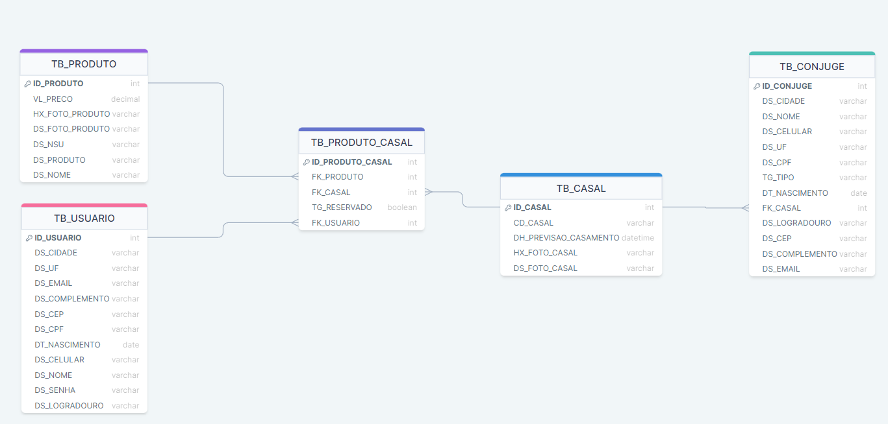
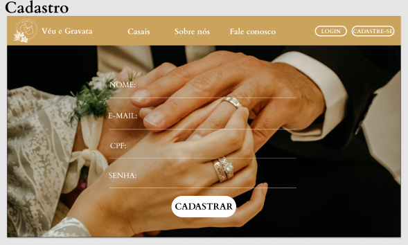
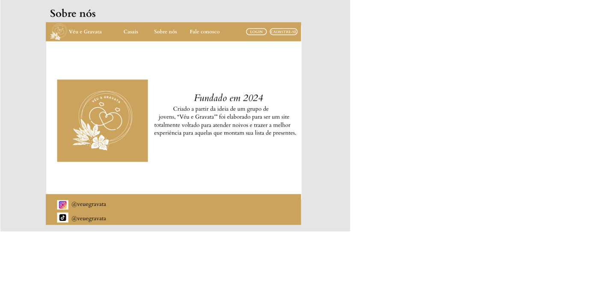

# Veu e Gravata
Repositório destinado ao trabalho de Projeto Integrador do 3º Semestre do curso de Análise e Desenvolvimento de Sistema do Senac

## MER - Modelo Entidade Relacionamento

## DER - Diagrama Entidade Relacionamento

## PROTOTIPAÇÃO

### Login

### Cadastro

### Sobre nós

## Fluxograma
